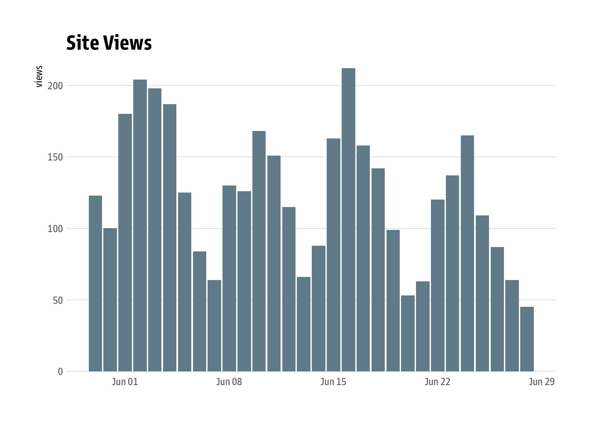

[](https://www.repostatus.org/#active)
[](https://keybase.io/hrbrmstr)

[](https://travis-ci.org/hrbrmstr/pressur)
[](https://codecov.io/gh/hrbrmstr/pressur)


# pressur

Query and Orchestrate the ‘WordPress’ ‘API’

## Description

‘WordPress’ has a fairly comprehensive ‘API’
<https://developer.wordpress.com/> that makes it possible to perform
blog orchestration (‘CRUD’ operations on posts, users, sites, etc.) as
well as retrieve and process blog statistics. Tools are provided to work
with the ‘WordPress’ ‘API’ functions.

### `<dalek_voice>` YOU WILL O-BEY `</dalek_voice>`

WordPress API requiring authentication means you have to do the OAuth2
dance, and most API calls require authentication. That means you need to
start off working with the WordPress API in/from `pressur` using the
`wp_auth()` function. For that to work, **YOU MUST**::

\=\> Go here and make an app: <https://developer.wordpress.com/apps/>

\=\> Put the `Client ID` you receive into `~/.Renviron` with a line that
looks like:

    `WORDPRESS_API_KEY=#####`

\=\> Put the `Client Secret` you receive into `~/.Renviron` with a line
that looks like:

    `WORDPRESS_API_SECRET=Yn50ds........`

And start with a fresh R session for any of this to even have a remote
possibility of working.

I’ll make friendlier documentation for ^^ in the near future.

### NOTE

Only minimal functionality is provided at present (enough to get stats
out).

You are encouraged to poke around the source and contribute PRs or
issues for high priority items you’d like to see in the package.

## What’s Inside The Tin

The following functions are implemented:

  - `wp_about_me`: Get metadata about the current user.
  - `wp_auth`: Authenticate to WordPress
  - `wp_get_posts`: Get all posts across all sites of the authenticated
    user
  - `wp_post_stats`: Retrieve statistics for a WordPress post
  - `wp_site_info`: Get information about a site
  - `wp_site_stats`: Get a site’s stats

## Installation

``` r
remotes::install_gitlab("hrbrmstr/pressur")
# or
remotes::install_github("hrbrmstr/pressur")
```

NOTE: To use the ‘remotes’ install options you will need to have the
[{remotes} package](https://github.com/r-lib/remotes) installed.

## Usage

``` r
library(pressur)

# current version
packageVersion("pressur")
## [1] '0.2.0'
```

### Basic operation

``` r
library(hrbrthemes)
library(ggplot2)

wp_auth()

stats <- wp_site_stats()

ggplot(stats$visits, aes(period, views)) +
  geom_col(fill = ft_cols$slate) +
  scale_y_comma() +
  labs(x = NULL, y = "views", title = "Site Views") +
  theme_ipsum_gs(grid="Y")
```



## Code of Conduct

Please note that this project is released with a Contributor Code of
Conduct. By participating in this project you agree to abide by its
terms.
